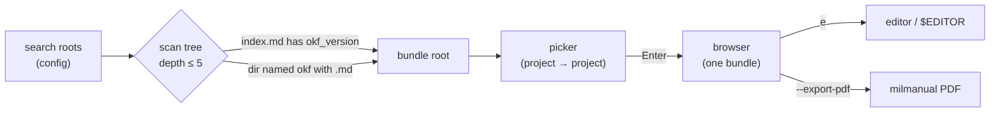

<div align="center">

```
 ██████╗ ██╗  ██╗███████╗██╗
██╔═══██╗██║ ██╔╝██╔════╝██║
██║   ██║█████╔╝ █████╗  ██║
██║   ██║██╔═██╗ ██╔══╝  ██║
╚██████╔╝██║  ██╗██║     ██║
 ╚═════╝ ╚═╝  ╚═╝╚═╝     ╚═╝
```

# OKFI — Open Knowledge Format Interface

**A terminal browser, editor, and PDF exporter for [Open Knowledge Format](https://github.com/GoogleCloudPlatform/knowledge-catalog) (OKF) bundles.**

Roam project&nbsp;→&nbsp;project through your OKF catalogs in a fast, keyboard-driven,
BBS-flavored TUI — read them, fold them, edit them, and typeset them.


</div>

---

## Contents

- [What is this?](#what-is-this)
- [Screenshot](#screenshot)
- [Install](#install)
- [Quick start](#quick-start)
- [Usage](#usage)
  - [Command-line flags](#command-line-flags)
  - [Key bindings](#key-bindings)
- [Configuration](#configuration)
- [Features](#features)
- [How discovery works](#how-discovery-works)
- [PDF export](#pdf-export)
- [The OKF catalog](#the-okf-catalog)
- [Development](#development)
- [Roadmap](#roadmap)
- [License](#license)

---

## What is this?

[OKF](https://github.com/GoogleCloudPlatform/knowledge-catalog/blob/main/okf/SPEC.md) is a
vendor-neutral, agent-agnostic standard for project knowledge: plain Markdown files with
YAML frontmatter, no database, no SDK. A **bundle** is a directory of *concept* files (one
per `.md`), plus the reserved `index.md` and `log.md`.

**okfi** is a single-file C/ncurses program that browses those bundles:

- discovers every bundle under your configured search roots and lists them in a **picker**;
- shows each bundle as a **type-grouped, collapsible tree** with counts;
- renders concept bodies with real **Markdown styling** (headings, emphasis, code, tables,
  links) and follows in-bundle **cross-links**;
- lets you **edit** concepts in place (built-in editor or `$EDITOR`) and **scaffold** new
  bundles/concepts;
- **exports** a concept to a typeset PDF.

> [!NOTE]
> The OKF spec is deliberately silent on *where* bundles live. okfi assumes the practical
> model: **decentralized storage** (one `okf/` per project repo, so the catalog travels with
> its code) + **centralized browsing** (one tool that roams across all of them). See
> [How discovery works](#how-discovery-works).

## Screenshot

```text
┌ TREE ──────────────────┬ CONTENT ───────────────────────────────────────────┐
│ ▾ Reference (3)         │ # Schema                                            │
│   OKF format            │                                                     │
│   Orders table          │ | Column      | Type   | Description              | │
│ ▸ Playbook (1)          │ |-------------|--------|--------------------------| │
│ ▾ ADR (2)               │ | order_id    | STRING | Globally unique order id │ │
│   Storage choice        │ | customer_id | STRING | FK to customers          │ │
│ > Component (1)         │                                                     │
│ ▾ reserved (2)          │ See [customers](/tables/customers.md).              │
│   index.md              │                                                     │
│   log.md                │                                                     │
└────────────────────────┴─────────────────────────────────────────────────────┘
 content  line 1/14   [1]customers
```

*(The focused pane is outlined and its title highlighted; on a color terminal the `bbs`
theme renders it in vivid cyan/magenta on blue.)*

## Install

> [!IMPORTANT]
> **Requirements:** a C11 compiler (`cc`/`gcc`), `ncursesw` (wide-character ncurses, found
> via `pkg-config`), and a POSIX system. PDF export additionally needs `pdflatex` and the
> [`milstd`](#pdf-export) LaTeX kit — neither is needed to build or browse.

```sh
git clone https://github.com/theesfeld/okfi.git
cd okfi
make
```

This produces the `okfi` binary in the project directory.

<details>
<summary>What <code>make</code> runs</summary>

```sh
cc -std=c11 -Wall -Wextra -O2 $(pkg-config --cflags ncursesw) \
   -o okfi okfi.c $(pkg-config --libs ncursesw)
```

The build is warning-free under `-Wall -Wextra`. Run the built-in self-check with
`./okfi --selftest` (exits `0` on success).
</details>

## Quick start

```sh
./okfi                         # browse every bundle under your search roots
./okfi path/to/okf             # open one bundle directly (skips the picker)
./okfi --new-bundle ./okf      # scaffold a fresh OKF bundle here
```

On first run with no config, okfi seeds sensible search roots (the parent of your current
directory, and `~/Projects` if it exists) and writes them to its config file.

## Usage

### Command-line flags

| Flag | Effect |
|------|--------|
| *(none)* | Browse all bundles discovered under the search roots |
| `<bundle-dir>` | Open that bundle directly |
| `--root DIR` | Add a search root for this run (repeatable) |
| `--mono`, `--no-color` | Force the monochrome interface |
| `--new-bundle DIR` | Scaffold a bundle (`index.md` + `log.md`) |
| `--new-concept BUNDLE NAME [TYPE]` | Scaffold a concept (default type `Concept`) |
| `--export-pdf CONCEPT.md` | Export a concept to `./<name>.pdf` |
| `--selftest` | Run the built-in self-check |
| `--help`, `-h` | Usage |

### Key bindings

**Bundle picker**

| Key | Action |
|-----|--------|
| `j` / `k`, `↓` / `↑` | move |
| `Enter` | open the selected bundle |
| `N` | create a new bundle |
| `,` | settings &nbsp;·&nbsp; `?` help &nbsp;·&nbsp; `q` quit |

**Browser**

| Key | Action |
|-----|--------|
| `F9` / `\` | open the menu bar (File · Edit · View · Settings · Help) |
| `j` / `k`, `↑` / `↓` | move within the focused pane |
| `l` / `→`, `h` / `←` | focus the content pane / the tree |
| `Tab` | collapse/expand the current group |
| `Shift+Tab` / `*` | collapse all groups / expand all |
| `Space` / `Enter` | fold a group, or open a concept |
| `g` / `G`, `J` / `K`, `PgDn`/`PgUp` | first/last · scroll the body |
| `1`–`9` | follow a numbered cross-link |
| `e` / `n` / `E` | edit · new concept · export PDF |
| `Esc` | back to the bundle list |
| `,` / `?` / `q` | settings / help / quit |

**Editor** (built-in)

| Key | Action |
|-----|--------|
| arrows, `Home` / `End` | move (by codepoint) |
| `^O` | save (atomic) |
| `^X` / `Esc` | cancel (single-key discard prompt) |

## Configuration

Config lives in an XDG-compliant location — `$XDG_CONFIG_HOME/okfi/config` (falling back to
`~/.config/okfi/config`). It is plain text, hand-editable, **written on every in-program
change**, and **preserves unknown keys** on rewrite.

```ini
# search roots — repeatable
root = /home/me/Projects
root = /home/me/work

theme        = bbs        # dark | light | bbs | mono
editor       = internal   # internal (built-in) | system ($VISUAL/$EDITOR)
group_order  = count      # type | count | priority
group_priority = ADR,Reference   # for group_order = priority

# per-role color overrides (256-colour indices, or `default`)
color.head = 51
color.bar  = 231,21       # fg,bg

# fold state (written automatically when you collapse a group)
fold = /home/me/Projects/foo/okf	reserved
```

> [!TIP]
> Everything is configurable from the in-app **settings screen** (`,`) — theme, editor,
> group order (the `priority` list is prompted for), search roots, and every colour role.
> Collapse state **persists across runs**, keyed per bundle.

<details>
<summary>Color roles you can override</summary>

`head` · `bold` · `ital` · `code` · `link` · `codeblk` · `key` · `bar` · `tag`

Each takes `fg` or `fg,bg` as 0–255 terminal colour indices (or `default` for the terminal
default). A set override beats the active theme.
</details>

## Features

- **Multi-bundle discovery** over configurable search roots, with a project→project picker.
- **Type-grouped tree** — headers per `type` with counts (`▾ Reference (3)`), collapsible
  (`Space`, or `*` for all), three orderings (`type` / `count` / `priority`), and fold state
  persisted per bundle.
- **Markdown rendering** — ATX headings, `**bold**`, `*italic*`, `` `code` `` (CommonMark
  backtick-run spans, **nested** emphasis), `[links]` with in-bundle cross-link following,
  bullet/blockquote, **pipe tables** (aligned, honoring `:--`/`--:`/`:--:`), fenced code,
  word-wrap with soft-line-break reflow, UTF-8 throughout.
- **Editor** — a built-in, codepoint-aware editor with **atomic** (temp + `rename`) saves,
  or your `$EDITOR`, selectable in settings.
- **Scaffolding** — new bundles and concepts (in-app or via CLI) that emit spec-conformant
  skeletons and prepend dated `log.md` entries.
- **Color** — automatic 256/16-colour detection, `bbs`/`default`/`mono` themes, per-role
  overrides; honours `NO_COLOR`.
- **PDF export** — see below.
- **Self-check** — `--selftest` exercises the frontmatter parser, inline styler, tables,
  cross-links, and LaTeX escaping.

## How discovery works



A directory is treated as a **bundle root** when its `index.md` carries `okf_version` (the
spec's canonical marker) or it is an `okf/`-named directory containing concept `.md` files.
Symlinks are skipped and the scan is depth-bounded, so it is safe to point a root at a large
tree.

## PDF export

`okfi --export-pdf <concept.md>` emits a LaTeX document and runs `pdflatex`, writing
`./<name>.pdf`.

> [!WARNING]
> PDF export uses the **`milstd`** military-document LaTeX kit (US technical-manual style),
> expected at `~/.config/milstd/`, plus a working `pdflatex`. The frontmatter becomes a
> `booktabs` table, headings map to `\section`/numbered paragraphs, pipe tables to
> `booktabs` tabulars, and fenced code to `listings`. All concept text is LaTeX-escaped; the
> engine is launched without a shell.

## The OKF catalog

This repository dogfoods OKF: its own knowledge catalog lives in [`okf/`](okf/).

| Concept | What it documents |
|---------|-------------------|
| [`okf-format.md`](okf/okf-format.md) | the OKF subset okfi parses |
| [`discovery.md`](okf/discovery.md) | bundle discovery + the placement model |
| [`tui-viewer.md`](okf/tui-viewer.md) | the browser view, tree, styling, cross-links |
| [`editor.md`](okf/editor.md) | the in-TUI editor |
| [`create.md`](okf/create.md) | scaffolding bundles and concepts |
| [`config.md`](okf/config.md) | every config option and the settings screen |
| [`pdf-export.md`](okf/pdf-export.md) | the PDF pipeline |
| [`build.md`](okf/build.md) | building and running |

## Development

```sh
make            # build (warning-free under -Wall -Wextra)
./okfi --selftest   # run the assert-based self-check
make clean
```

The program is a single translation unit, [`okfi.c`](okfi.c). Standard C11 for the language;
ncursesw and POSIX (`fork`/`exec`, `mkdtemp`, `open_memstream`, …) for the runtime.

## Roadmap

- [x] Multi-bundle discovery + picker
- [x] Collapsible type tree with counts, persisted folds, configurable order
- [x] Markdown rendering (nested inline, tables, cross-links, reflow)
- [x] In-TUI editor (atomic save) and `$EDITOR` option
- [x] PDF export (milstd `milmanual`)
- [ ] Horizontal scroll for very wide tables
- [ ] Interactive link navigation beyond digit jumps
- [ ] Whole-bundle PDF (one document, chapter per concept)

## License

> [!NOTE]
> No license file is present yet — until one is added, all rights are reserved by the
> author. If you'd like to use or contribute, open an issue.

---

<div align="center">
<sub>Built with C, ncursesw, and a fondness for old bulletin boards.</sub>
</div>
